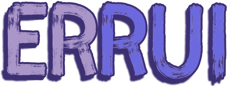

<div align="center">
 
 <hr/>
  
  
  
  
  
</div>

# Introduction

:baseball:This is a personal website project with front-end rendering provided by `nextjs` and data service provided by `go`, which will be continuously updated.:wink: <br />
:book:Read this in other languages: [_简体中文_](docs/README.zh-CN.md). Thanks for giving this project stars.:star2:


# Getting started

Run the following command on your local environment:

```bash
git clone git@github.com:arreychan/arrey-website.git

cd arrey-website

yarn install    
```

Then, you can run locally in development mode with live reload:

```bash
yarn dev
```

Open http://localhost:3000 with your favorite browser to see this project.

# Deploy to production

You can see the results locally in production mode with:

```bash 
yarn build 
yarn start
```

# Features

- [x] homepage 

- [x] mobile adaptation 

- [ ] backend management system base on golang

  


# Contributions

Feel free to open an issue if you have question or found a bug.

Update 2025

# License

- Licensed under the GPL-3.0 License, Copyright © 2022. See [LICENSE](./License) for more information.
- The images and video works involved in this project is licensed under the [CC 4.0 BY-NC-SA](http://creativecommons.org/licenses/by-nc-sa/4.0/).

